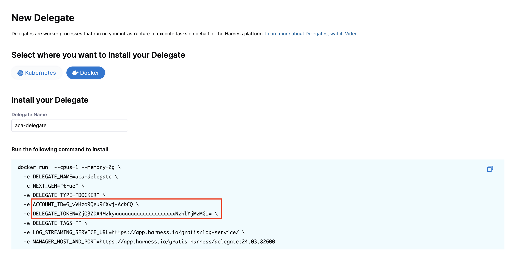

# aca-demo

## Usage 

### ACA Delegate
Create a new docker delegate in the Harness platform and copy the value for `ACCOUNT_ID` and `DELEGATE_TOKEN`


Create the container app:
```
az containerapp create \
  --name $APP_NAME \
  --environment $APP_ENVIRONMENT_NAME \
  --resource-group $RESOURCE_GROUP \
  --cpu 1 \
  --memory 2.0Gi \
  --image $HARNESS_DELEGATE_IMAGE \
  --env-vars DELEGATE_NAME="$HARNESS_DELEGATE_NAME" NEXT_GEN="$HARNESS_NEXT_GEN" DELEGATE_TYPE="$HARNESS_DELEGATE_TYPE" ACCOUNT_ID=$HARNESS_ACCOUNT_ID DELEGATE_TOKEN=$HARNESS_DELEGATE_TOKEN DELEGATE_TAGS="$HARNESS_DELEGATE_TAGS" LOG_STREAMING_SERVICE_URL="$HARNESS_LOG_STREAMING_SERVICE_URL" MANAGER_HOST_AND_PORT="$HARNESS_MANAGER_HOST_AND_PORT"
```

A full setup example is also provided:
- [`harness_aca_delegate.sh`](aca_delegate/harness_aca_delegate.sh)

### Harness Deployment Template
Below is the structure of the Deployment Template with the associated Step Templates:

- [`ACA_Deployment_Template.yaml`](harness_deployment_template/ACA_Deployment_Template.yaml)
  - [`ACA_Step_Identify_Target_Deployment.yaml`](harness_deployment_template/ACA_Step_Identify_Target_Deployment.yaml)
  - [`ACA_Step_Blue_Green_Deploy.yaml`](harness_deployment_template/ACA_Step_Blue_Green_Deploy.yaml)
  - [`ACA_Step_Blue_Green_Swap.yaml`](harness_deployment_template/ACA_Step_Blue_Green_Swap.yaml)
  - [`ACA_Step_Validate_Swap.yaml`](harness_deployment_template/ACA_Step_Validate_Swap.yaml)

An example Pipeline using this Deployment Template is also provided:
- [`Example_Pipeline.yaml`](harness_deployment_template/Example_Pipeline.yaml)


